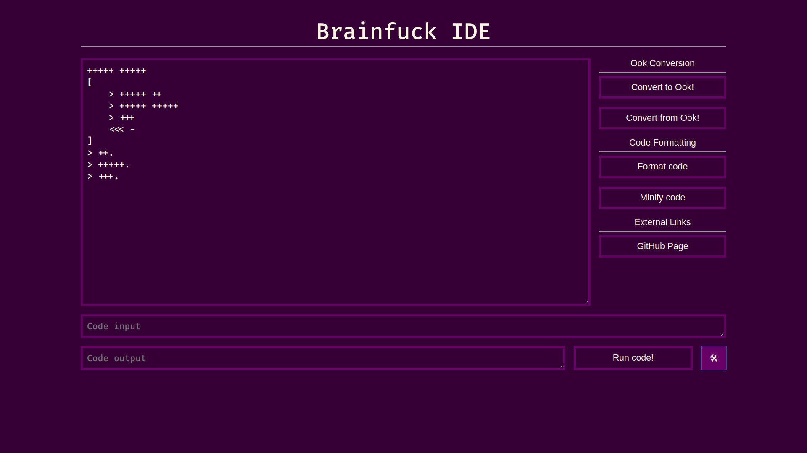

# Elm-Brainfuck-IDE

Elm-Brainfuck-IDE is a Brainfuck IDE that's written in Elm.

## Why?

The creation of an IDE for developing Brainfuck has always been an interest of mine. 

In June 2015, I began working on a [Brainfuck IDE in Java](https://github.com/JorelAli/Brainfuck-IDE). It used Java's Swing library to create a desktop application, and used [fabianishere's brainfuck-java project](https://github.com/fabianishere/brainfuck-java) as the brainfuck interpreter (since I was not smart enough to implement a brainfuck interpreter at the time).

After some time, (in September 2017), I decided to rewrite the IDE and have it as an online service, so you can edit brainfuck online. This became my [Brainfuck_IDE_Online](https://github.com/JorelAli/Brainfuck_IDE_Online), which used NodeJS ([express](https://expressjs.com/) and [socket.io](https://socket.io/)). Unfortunately, that never really took off (it had code formatting and code unformatting, but no evaluation).

Now, in 2019, I decided to recreate the project in [Elm](http://elm-lang.org/), as I am currently learning Elm for web development.

## Outcomes

The list of things that I believe to have gained by doing this project:

- Use of [`Browser.document`](https://package.elm-lang.org/packages/elm/browser/latest/Browser#document) to gain full control over the entire webpage and interact by using `Cmd` and `Sub`
- Use of [elm-css](https://github.com/rtfeldman/elm-css) to style the webpage in a typed environment
- Use of Elm's `Cmd` system to request to load URL pages and gain a better understanding of the Elm architecture
- Use of multiple files to modularize the project

## Acknowledgements

The Elm-Brainfuck-IDE took inspiration from the following projects:

- [copy's brainfuck interpreter](https://copy.sh/brainfuck) - Primarily the idea to parse the entire input to the program in one go
- [fatiherikli's brainfuck visualizer](https://fatiherikli.github.io/brainfuck-visualizer) - UI inspiration

## Screenshots (or it never happened)

